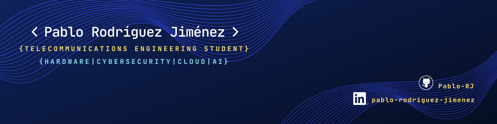

  

# Hi, I'm Pablo Rodríguez Jiménez 👋
### Telecommunications & Systems Engineer | Bridging Hardware, Cloud & AI | University of Granada, Spain.

---

## 🚀 Professional Vision
I am a Telecommunications Engineering student focused on **building secure, scalable cyber-physical systems**. My goal is to master the intersection of **Hardware Engineering, Digital Signal Processing, Cloud Infrastructure, and AI** to develop mission-critical infrastructure that connects physical environments with intelligent software.

- 📡 **Hardware & Signals:** Digital Signal Processing (Audio/Video), circuit analysis, and embedded systems architecture.
- ☁️ **Cloud & Architecture:** Building highly available data pipelines and systems (AWS/Azure/GCP) using Infrastructure as Code (Terraform).
- 🛡️ **Cybersecurity:** Focused on DevSecOps, infrastructure hardening, and securing the hardware-to-cloud data flow.
- 🤖 **Applied AI:** Implementing MLOps and scalable inference models for real-time telemetry and signal data.

---

## 🛠️ Tech Stack & Tooling

| Domain | Technologies |
| :--- | :--- |
| **Languages** | Python, C/C++, Bash, SQL |
| **Hardware & Electronics** | Altium Designer, PCB Schematic Design, Oscilloscope Measurement & Instrumentation, ESP32 / Arduino / Raspberry Pi Architecture, Circuit Analysis |
| **Telecom & Signals** | Digital Signal Processing (Audio/Video), 5G Infrastructure, Wireless & Mobile Systems, Software Defined Networking (SDN), TCP/IP |
| **Cloud & DevOps** | Google Cloud, Azure, AWS, Docker, Podman, Terraform, GitHub Actions (CI/CD) |
| **Security** | OWASP, Network Security, Linux Hardening, Cryptography, Trivy |
| **Data & AI** | PyTorch, Scikit-Learn, MLOps Basics |

---

## 🏗️ Featured Projects

### 🔹 [TFG] Electromagnetic Compatibility (EMC) & Signal Integrity Analysis | `Hardware` `LISN` `Signal Processing`
 
* **Domain:** Undergraduate Final Degree Project (I+D) at the University of Granada.
* **Problem Space:** Analyzing and mitigating Electromagnetic Interference (EMI) to ensure hardware reliability in noisy electronic environments.
* **Instrumentation & Testing:** Conducting physical measurements using a **Line Impedance Stabilization Network (LISN)** to isolate power line noise and characterize conducted emissions.
* **Signal Analysis:** Utilizing oscilloscopes and spectrum analysis to validate signal integrity, filtering techniques, and hardware shielding effectiveness.
* **Current Stage:** Capturing physical lab measurements and correlating empirical data with theoretical EMC models.
* [🔗 View R&D Documentation & Lab Measurements](#) *(Link pending)*

### 🔹 Scalable IoT Telemetry System | `ESP32` `MQTT` `InfluxDB` `Grafana` 
 
* **Problem:** Efficiently capturing and visualizing high-frequency sensor data from remote devices without losing data integrity.
* **Solution:** Designed an end-to-end telemetry pipeline using the MQTT protocol for lightweight messaging and a Time-Series Database (TSDB) for optimized storage.
* **Tech Stack:** Dockerized environment with Node-RED for orchestration and InfluxDB for persistence.
* [🔗 View Repository](https://github.com/Pablo-RJ/ESP32-IoT-Telemetry)

### 🔹 Automated Container Security Pipeline (DevSecOps) | `Docker` `Trivy` `CI/CD`
 
* **Problem:** Vulnerabilities in container images often go undetected until production, increasing the attack surface.
* **Solution:** Building a secure containerization workflow that integrates **Trivy** for automated vulnerability scanning (CVEs).
* **Current Stage:** Refining CI/CD YAML configurations and security gate policies. 
* [🔗 View Repository](https://github.com/Pablo-RJ/Secure-Artifact-Repository)

---

## 📈 Roadmap to Graduation (2026-2027)
- [ ] **H2 2027:** Final Degree Project (TFG) focusing on Electromagnetic Compatibility (EMC) and Signal Integrity in complex systems.
- [ ] **2026-2027:** Google Cloud Associate Cloud Engineer & CompTIA Security+ Certifications.
- [ ] **2027:** Bridging the gap: Contributing to Open Source projects involving IoT infrastructure, hardware-in-the-loop (HIL) testing, or Cloud-Native (CNCF) environments.

## 🔍 Deep Dive & Core Specializations
*My journey into 2027 focuses on mastering the synergy between physical hardware reliability, secure infrastructure, and cloud intelligence.*

- ⚡ **EMC & Signal Integrity:** Electromagnetic Compatibility testing, shielding, and ensuring robust hardware performance in noisy environments.
- 🛡️ **Advanced Cybersecurity:** Network Security, Pentesting fundamentals, and securing the hardware-to-cloud data flow (Zero Trust).
- ☁️ **Cloud-Native Ecosystem:** Focus on high availability, cost-optimization, and Infrastructure as Code (IaC).
- 🤖 **Applied AI & MLOps:** Integrating LLMs and Neural Networks into scalable production pipelines for real-time sensor and telemetry analysis.
- 📦 **Containerization & DevSecOps:** Orchestration using Docker/Kubernetes and automating secure pipelines with Terraform, Ansible, and CI/CD.

---

### 🛠️ Core Technologies

  

---

## 📫 Connect with me

